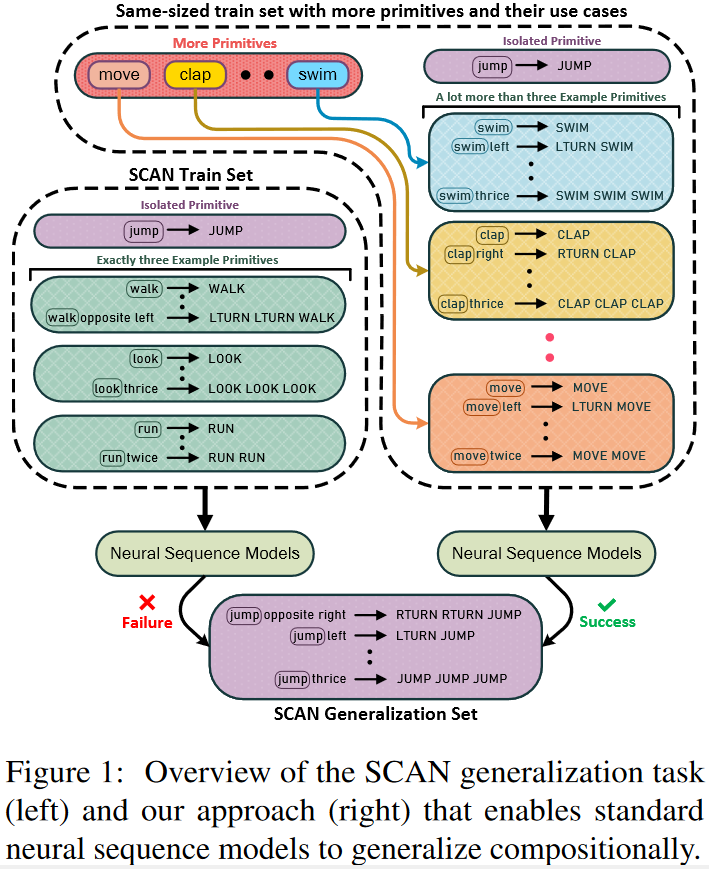

<h2 align="center">
  Compositional Generalization in Seq2Seq Models
</h2>
<h5 align="center"> Revisiting the Compositional Generalization Abilities of Neural Sequence Models</h5>

<p align="center">
  <a href="https://www.2022.aclweb.org/"></a>
  <a href="https://openreview.net/pdf?id=7lJpG58T5qy"></a>
  <a href="https://github.com/arkilpatel/Compositional-Generalization-Seq2Seq/blob/main/LICENSE">
    
  </a>
</p>


<p style="text-align: justify;">
Recently, there has been an increased interest in evaluating whether neural models are able to generalize compositionally. <a href="https://arxiv.org/abs/1711.00350">Previous work</a> had shown that seq2seq models such as LSTMs lack the inductive biases required for compositional generalization. We show that by modifying the training data distributions, neural sequence models such as LSTMs and Transformers achieve near perfect accuracies on compositional generalization benchmarks such as <a href="https://arxiv.org/abs/1711.00350">SCAN</a> and <a href="https://arxiv.org/abs/1901.04587">Colors</a>.
</p>

<h2 align="center">
  
</h2>

####  Dependencies

- compatible with python 3.6
- dependencies can be installed using `Compositional-Generalization-Seq2Seq/code/requirements.txt`

#### Setup

Install VirtualEnv using the following (optional):

```shell
$ [sudo] pip install virtualenv
```

Create and activate your virtual environment (optional):

```shell
$ virtualenv -p python3 venv
$ source venv/bin/activate
```

Install all the required packages:

at `Compositional-Generalization-Seq2Seq/code:`

```shell
$ pip install -r requirements.txt
```

To create the relevant directories, run the following command in the corresponding directory of that model:

for eg, at `Compositional-Generalization-Seq2Seq/code/transformer:`

```shell
$ sh setup.sh
```

Then transfer all the data folders to the data subdirectory of that model, which in case is `Compositional-Generalization-Seq2Seq/code/transformer/data/`

#### Models

The current repository includes implementations of 2 Models:

- Transformer in `Compositional-Generalization-Seq2Seq/code/transformer`
  - Sequence-to-Sequence Transformer Model
- LSTM in `Compositional-Generalization-Seq2Seq/code/lstm`
  - Sequence-to-Sequence LSTM Model

#### Datasets

We work with the following datasets:

- SCAN add jump split
  - Train Data Size: 13,204 examples
  - Test Data Size: 7,706 examples
  - Available online at: https://github.com/brendenlake/SCAN

- Colors
  - Train Data Size: 14 examples
  - Test Data Size: 8 examples

- COGS
  - Train Data Size: 24,155 examples
  - Test Data Size: 21,000 examples
  - Available online at: https://github.com/najoungkim/COGS

#### Usage:

The set of command line arguments available can be seen in the respective `args.py` file. Here, we illustrate running a Transformer on the SCAN add_jump dataset. Follow the same methodology for running any experiment over any model.

##### Running Transformer Model on SCAN add_jump

at `Compositional-Generalization-Seq2Seq/code/transformer:`

```shell
$	python -m src.main -mode train -pretrained_model_name none -finetune_data_voc none -dataset add_jump -epochs 150 -no-save_model -no-show_train_acc -embedding random -no-freeze_emb -no-freeze_transformer -d_model 128 -d_ff 256 -decoder_layers 3 -encoder_layers 3 -heads 2 -batch_size 64 -lr 0.0005 -emb_lr 0.0005 -dropout 0.1 -run_name run_add_jump_transformer -gpu 0
```

#### Citation

If you use our data or code, please cite our work:

```
Add ArXiV citation
```

For any clarification, comments, or suggestions please contact [Arkil](http://arkilpatel.github.io/) or [Satwik](https://satwikb.com/).